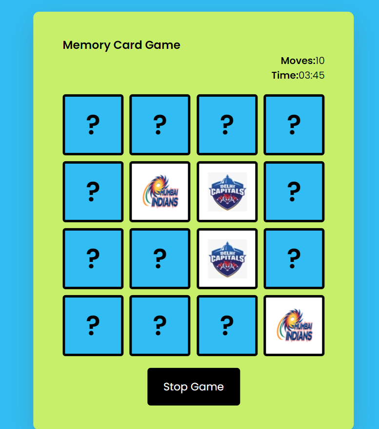

# Memory Card Game

A simple and fun web-based memory card game where the objective is to match all pairs of cards with the fewest moves and in the shortest time possible.

## How to Play
1. **Start the Game**:
   - All cards are initially faced down.
   - Players must click on two cards per turn to reveal the images.

2. **Making a Move**:
   - Click on two cards to flip them over and reveal their images.
   - If the images match, the cards stay face up.
   - If the images do not match, the cards will be flipped back face down after a short delay.

3. **Matching Cards**:
   - Continue flipping two cards at a time and try to remember the positions of the previously revealed cards to find matching pairs.

4. **Moves Count**:
   - Each time you flip two cards, whether they match or not, it counts as one move.
   - The total number of moves is displayed on the screen.

5. **Timer**:
   - The game tracks the total time taken to complete the game.
   - Try to finish the game as quickly as possible.

6. **Winning the Game**:
   - The game ends when all pairs are successfully matched.
   - You win when all the cards are face up.

7. **Stopping the Game**:
   - You can stop the game at any time by clicking the "Stop Game" button.

## Features
- Interactive UI to flip and reveal cards.
- Tracks number of moves and total time.
- Visual feedback when cards are matched.
- A "Stop Game" button to end the game at any point.

## Screenshot

## Technologies Used
- HTML5
- CSS3
- JavaScript

## Installation
1. Clone the repository:
   bash
   git clone https://github.com/your-username/memory-card-game.git
2. Navigate to the project directory:
   bash
    cd memory-card-game
3. Open the index.html file in your browser to start playing the game.
